  

  
  
  
  
  
  

# 🚀 Awesome-Automated-Bill-Lowering
## 💰 Top Automated Bill Lowering Softwares Ecosystem

**📋 Curated List of SaaS Products & Open-Source GitHub Projects**  
*🎯 Focused on AI Bill Negotiation, Subscription Management & Cost Optimization*  
**🗓️ Last updated: March 2026**

> **Keywords**: automated bill lowering, AI bill negotiation, reduce bills automatically, subscription management tools, bill negotiation software, lower cable bill, lower internet bill, save money on bills, cancel subscriptions, expense optimization, personal finance automation, open-source bill tracker

This repository is the **most comprehensive list of automated bill lowering software** — tracking notable **SaaS platforms** and **open-source projects** that help you **save money on recurring bills**. These tools 📊 analyze your bills, 📱 subscriptions, and recurring expenses, 🤝 negotiate lower rates with providers, ❌ cancel unused services, and ⚡ optimize spending automatically.

**✨ Examples** include Trim, Rocket Money, Billshark, and Kudos (the category leaders). Tools listed here emphasize **🤖 AI-powered bill negotiation**, 📋 automatic subscription tracking, 🔍 hidden savings discovery, and ⚙️ automated cost reduction actions.

**🔓 Open-source emphasis**: This section is heavily expanded with every major active project for 🏠 self-hosting, 💻 local processing, 🛠️ full customization, and 🔒 complete data privacy — ideal for individuals and families who want sovereign bill optimization without sharing financial data.

🙌 Contributions welcome! Open a PR to add/update entries. Keep descriptions factual and link to official sites.

## 📑 Table of Contents
- [💼 SaaS Products](#-saas-products)
- [🔓 Open-Source GitHub Projects](#-open-source-github-projects)
- [🤝 How to Contribute](#-how-to-contribute)
- [⚠️ Disclaimer](#%EF%B8%8F-disclaimer)

## 💼 SaaS Products

### 🏆 Core Platforms (Automated Bill Lowering)

| Name | Description | Pricing | Company Size |
|------|-------------|---------|--------------|
| **[Rocket Money](https://rocketmoney.com/)** | Popular app for tracking subscriptions, negotiating bills, and optimizing personal finances. | **Free tier:** Subscription tracking, basic budgeting (2 categories), spending alerts. **Premium:** $7–$14/mo (pay-what-you-want, 7-day free trial). **Bill negotiation:** 35–60% of first year's savings (available on free & premium). | **$1.275B** acquisition by Rocket Companies (2021) |
| **[Trim](https://trim.app/)** | AI-powered bill negotiation and subscription management service that automatically saves users money. | ⚠️ **Discontinued** — Acquired by OneMain Financial in 2021; no longer active as a consumer service. | Acquired by OneMain Financial (~$6.5B market cap); deal terms undisclosed |
| **[Kudos](https://joinkudos.com/)** | AI bill reduction platform focused on proactive negotiation and expense optimization. | **Free tier:** Basic bill negotiation & credit card reward optimization. **Premium:** $71.95/year. No commission on savings — you keep 100%. | **$13.5M** total funding (Series A) |
| **[Billshark](https://www.billshark.com/)** | Bill negotiation service that fights for lower rates on cable, internet, insurance, and more. | **No upfront fees.** Success fee: 40% of total savings. Subscription cancellation: $9/cancelled subscription. No savings = no charge. | **~$3M** seed funding |
| **[BillCutterz](https://www.billcutterz.com/)** | Negotiates lower rates on cell phone, cable, internet, home security, and satellite radio bills. | **No upfront fees.** Success fee: 50% of savings. Pay-in-full discount: additional 10% off fee. No savings = no charge. | Undisclosed (bootstrapped) |

### 🔧 Advanced & Specialized Platforms

**Other notable mentions**: Truebill (now Rocket Money) and various personal finance AI tools.

## 🔓 Open-Source GitHub Projects

### 🛠️ Dedicated Bill Lowering & Subscription Management Tools

- **[n8n Bill Optimization Workflows](https://github.com/n8n-io/n8n)**   
  Open-source automation tool with LLM nodes for building custom bill tracking, negotiation scripts, and subscription management systems.

- **[Home Assistant](https://github.com/home-assistant/core)**  — with energy and expense tracking integrations.

- **[Odoo](https://github.com/odoo/odoo)**   
  Comprehensive open-source business suite with powerful accounting and subscription management tools.

- **[Huginn Bill Agents](https://github.com/huginn/huginn)**   
  Open-source automation agent that can monitor bills, detect price changes, and trigger optimization actions.

- **[Phidata Finance Agents](https://github.com/phidatahq/phidata)**   
  Framework for building production agents with memory and tools for personal finance optimization.

- **[LangGraph Finance Agents](https://github.com/langchain-ai/langgraph)**   
  Stateful multi-agent framework for building AI agents that analyze bills and suggest optimizations.

- **[Actual Budget](https://github.com/actualbudget/actual)**   
  Open-source budgeting tool with AI-friendly data structures for identifying and optimizing recurring expenses.

- **[Frappe/ERPNext](https://github.com/frappe/erpnext)**   
  Full open-source ERP with expense, subscription, and cost optimization modules suitable for personal or small business use.

- **[Firefly III](https://github.com/firefly-iii/firefly-iii)**   
  Open-source personal finance manager with strong subscription tracking and expense categorization features.

- **[Akaunting](https://github.com/akaunting/akaunting)**   
  Open-source online accounting software with expense tracking and bill management features.

- **[Beancount](https://github.com/beancount/beancount)**  — Powerful plain-text accounting system.

- **[hledger](https://github.com/simonmichael/hledger)**  — Command-line accounting tool with scripting capabilities.

- **[GnuCash](https://github.com/Gnucash/gnucash)**  — Double-entry accounting with bill management.

- **[Budget with Buckets](https://github.com/buckets/application)**   
  Open-source envelope budgeting system with potential for bill tracking automation.

### 📚 Additional Resources

- **Many community Python scripts** for scraping bills and negotiating via APIs.
- **Ollama + Receipt OCR** pipelines for local bill analysis and optimization agents.

🧰 **Frameworks for building custom tools**: Combine **Firefly III**, **n8n**, **LangGraph**, and **Huginn** with **Ollama** to create fully private, AI-powered bill lowering systems.

## 🤝 How to Contribute

1. 🍴 Fork the repo.
2. ✏️ Add/edit entries in `README.md` (follow existing format).
3. 📝 Include: name, link, 1–2 sentence description, and whether it's SaaS or open-source.
4. 📬 Submit PR with a short explanation.

⭐ Star the repo if you find it useful!

## ⚠️ Disclaimer

- This is a **community-curated** list — not exhaustive and not an endorsement.
- Automated bill negotiation should comply with service provider terms and local consumer protection laws.
- Self-hosted open-source solutions require careful data security when handling financial information.

---

**💚 Made for budget-conscious individuals, families, and small business owners.**  
🌟 Let's make bill management smarter, more automated, and fully private.

## ❓ Frequently Asked Questions

**What is automated bill lowering?**  
Automated bill lowering uses AI and software tools to negotiate lower rates on your recurring bills (internet, cable, phone, insurance) without you having to call providers yourself.

**How do bill negotiation apps make money?**  
Most bill negotiation services charge a percentage (typically 30–60%) of the savings they achieve for you. If they don't save you money, you don't pay.

**Are there free bill negotiation tools?**  
Yes! Rocket Money and Kudos both offer free tiers. Open-source tools like n8n, Firefly III, and Huginn are completely free to self-host.

**Can I build my own bill lowering system?**  
Absolutely. Combine open-source tools like n8n (automation), Firefly III (finance tracking), LangGraph (AI agents), and Ollama (local LLM) to build a fully private, AI-powered bill optimization pipeline.
